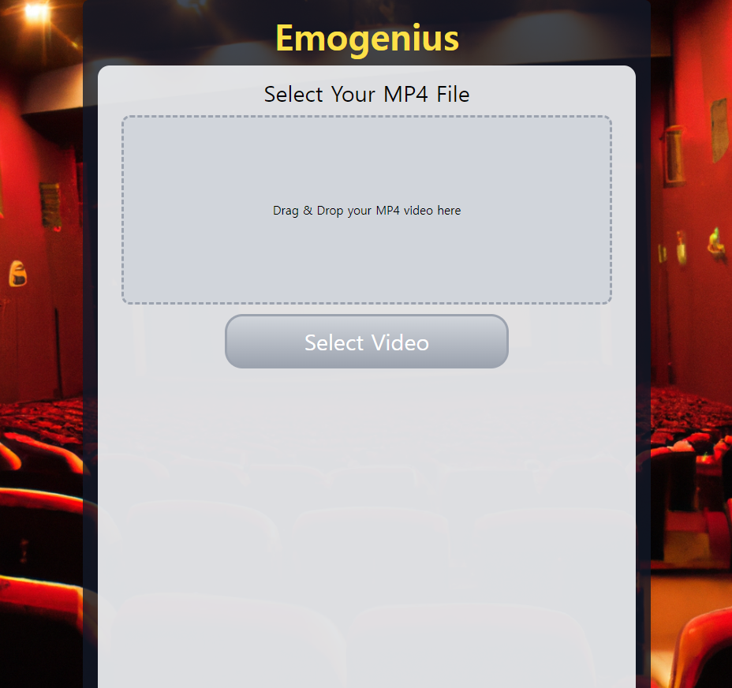
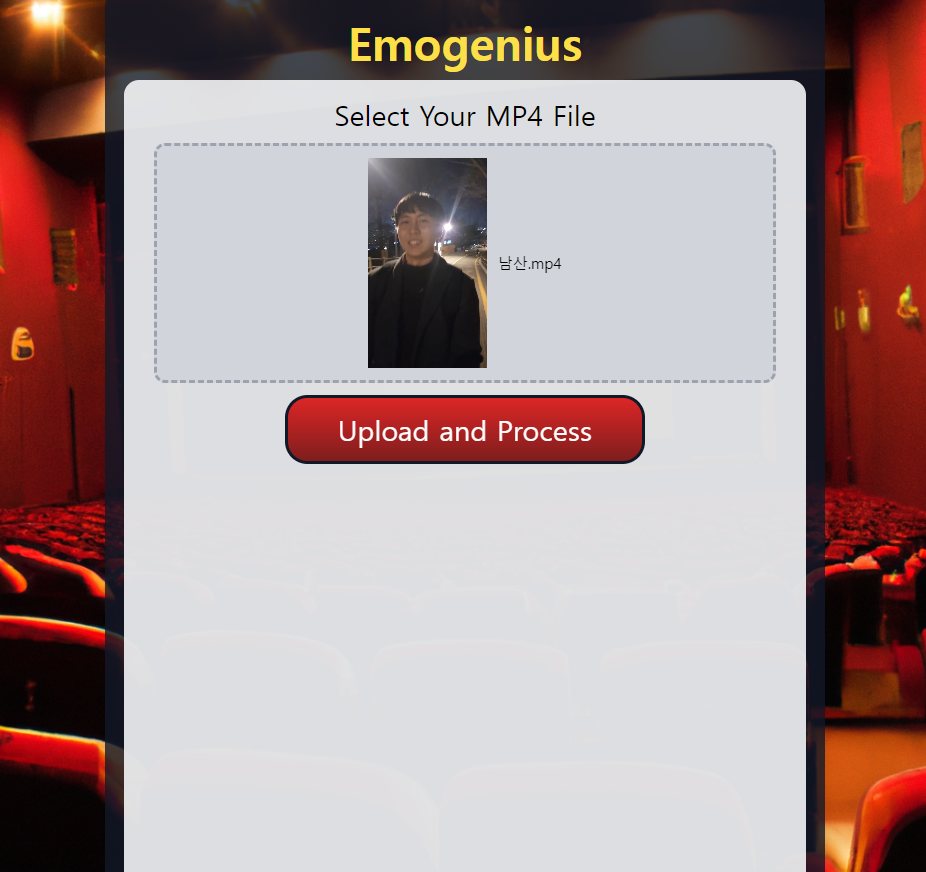
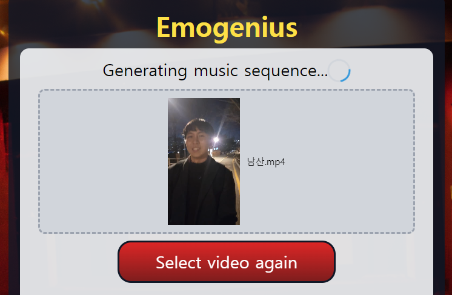
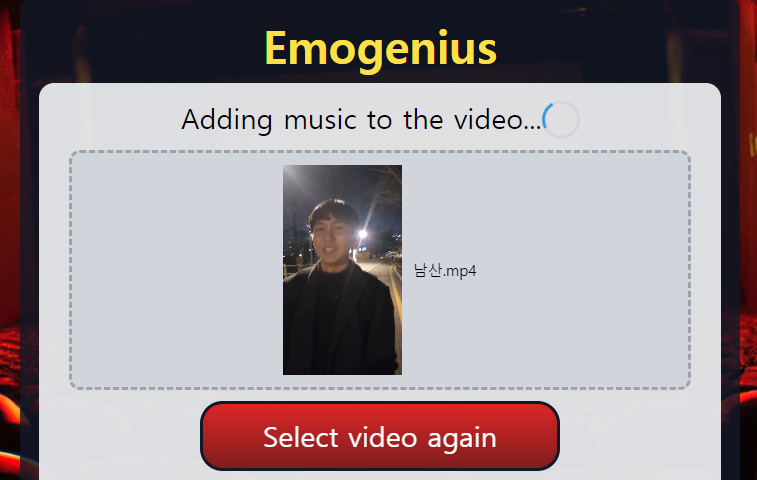
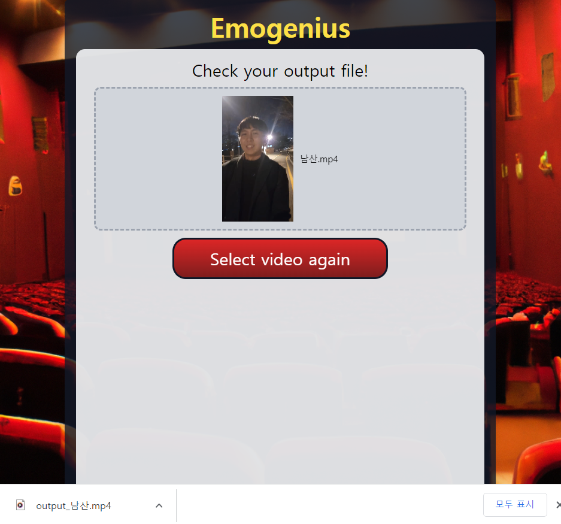

# emogenius

영상 속의 음성 분위기와 어울리는 음악을 작곡하여 합성해주는 서비스

## 실행화면
* **메인 화면** 
서비스의 메인 페이지. 음악을 합성할 영상 파일을 선택하거나 드래그 앤 드롭 할 수 있다. 
</img>
</img>
  
* **로딩 화면** 
음악 파일을 생성하는 과정과 생성된 음악 파일을 영상에 합성하는 과정으로 나뉜다.
</img>
</img>
  
* **결과 화면** 
생성된 음악이 합성된 새 영상이 사용자의 PC로 다운로드된다. Select video again을 클릭하면 페이지가 리로드된다. 
</img>  

## 주요 이슈
**1. 음악 작곡** 
google의 magenta라는 인공지능 작곡 라이브러리를 이용하였다. music vae모델을 이용한 링크( https://codepen.io/iansimon/details/Bxgbgz )의 코드를 참고하였고 라이브러리 코드를 살펴보며 여러가지 기능을 수정하였는데,
* react의 useEffect, useState를 이용하여 비동기 실행이 잘 이루어지도록 조정하였고
* z1과 z2를 interpolate하던 기존 코드를 하나의 z텐서를 이용하도록 수정하였으며
* note의 instrument와 program인자를 이용해 원하는 악기 소리를 지정할 수 있도록 하였고
* 두 개의 midi sequence를 생성해 하나는 low temperature로 안정적인 반주를 생성하도록 하고 다른 하나는 high temperature로 상대적으로 불규칙적인 멜로디를 생성하도록 하여 하나로 합쳤다.
다른 팀원들과 진행중인 과제에서는 음성-감정 추출 인공지능을 이용하여 30초마다 음성에서 느껴지는 감정을 추출한 후, 해당 감정들에 어울리는 코드진행과 악기들로 작곡을 할 예정이지만, 서비스의 실행을 좀 더 신속하게 확인하기 위해 30초마다의 감정들을 직접 코드상에서 array로 지정하는 방법으로 구현하였다.  

**2. 음악 합성** 
midi 파일이 mp3나 wav 파일 형식과는 다르게, 악기의 번호와 음의 높이 등을 지정하였을 뿐인 형식의 파일이어서 영상에 합성하기 위해서는 먼저 wav파일로 변환시켜야 한다. 따라서 클라이언트의 magentaPlayer 컴포넌트가 생성한 midi 파일을 서버로 전송한 후, 서버에서 fluidsynth child process를 이용하여 midi 파일과 준비된 사운드폰트 파일을 이용해 wav파일을 생성한다. 그 후, ffmpeg 라이브러리를 이용하여 사용자가 업로드한 동영상에 해당 wav파일을 합성하여 다시 클라이언트로 전송한다.
